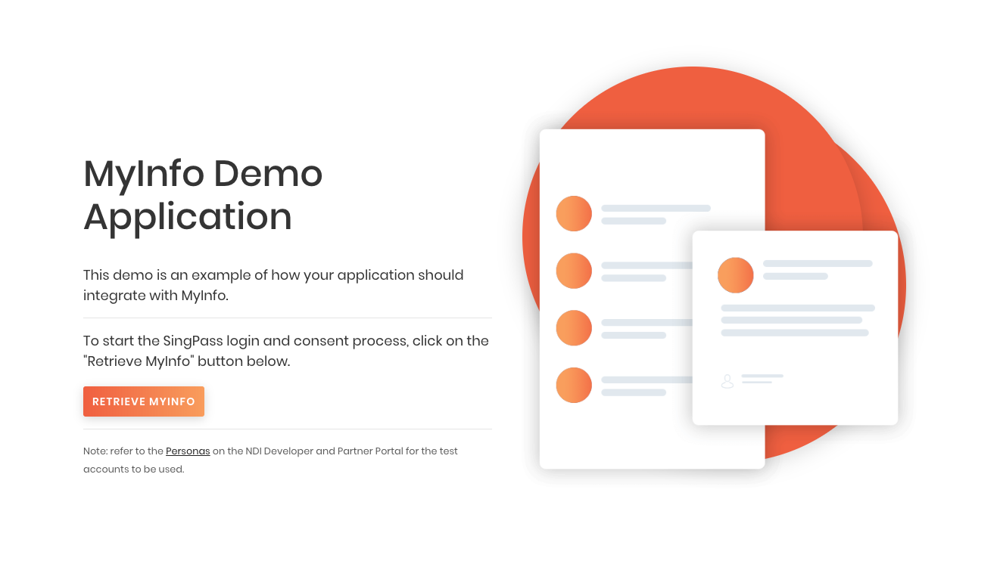
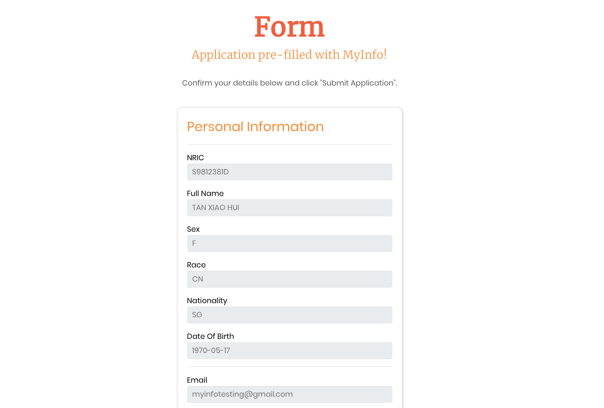

<p align="center">
<a href="https://www.ndi-api.gov.sg/library/myinfo/introduction">
  
  </a>
</p>

# MyInfo Demo App

The demo application meant to illustrate how to integrate your application with MyInfo APIs.


## Contents


- [Quick Start](#quick-start)
- [How To Use](#how-to-use)
- [MyInfo Connector NodeJS](#lib)
  - [Troubleshooting](#problem)
- [Change Logs](./.CHANGELOG.md)

<br/><br/>


## <a name="quick-start"></a>Quick Start

### 1.1 Install Node and NPM (_skip this step if you have NPM installed_)

For the demo application to run, you will need to install Node and NPM.

Follow the instructions given by the links below depending on your OS.

- [Install Node and NPM for Windows](http://blog.teamtreehouse.com/install-node-js-npm-windows)
- [Install Node and NPM for Linux](http://blog.teamtreehouse.com/install-node-js-npm-linux)
- [Install Node and NPM for Mac](http://blog.teamtreehouse.com/install-node-js-npm-mac)


### 1.2 Run NPM install

Run the following command in the folder you unzipped the application:

```
npm install
```

### 1.3 Start the Application

Execute the following command to start the application:

Test <b>with</b> Payload Encryption & PKI Digital Signature

```
npm start
```

Or, test <b>without</b> Payload Encryption & PKI Digital Signature

```
npm run sandbox
```


<br/>


**Access the Application on Your Browser**
You should be able to access the sample application via the following URL or click [here](http://localhost:3001):

```
http://localhost:3001
```





---

## <a name="how-to-use"></a>How To Use

### Login with SingPass

Click **RETRIEVE MYINFO** and select the test user ID from the Mock Pass. 

*Note: refer to the Personas on the NDI Developer and Partner Portal for the test accounts to be used.*


---

## <a name="lib"></a>MyInfo Connector NodeJS

This demo application is using the [myinfo-connector-nodejs](https://www.npmjs.com/package/myinfo-connector-nodejs) library. MyInfo Connector aims to simplify consumer's integration effort by providing an easy to use Javascript library to integrate into your application.


### <a name="problem"></a>Troubleshooting

<details><summary>Change the logging level for debugging within the library.</summary>

Edit the ``./config/config.js`` , change the ``DEBUG_LEVEL`` value to ``debug``. 

*IMPORTANT NOTE: debug mode should never be turned on in production*

</details>

<details><summary>OpenSSL Installation [For Windows only]</summary>

Skip this step if you have OpenSSL installed.

For windows user, you are required to install the OpenSSL library in your computer in order to use myinfo-connector-nodejs library. Please refer to the OpenSSL installation guide [here](https://public.cloud.myinfo.gov.sg/docs/OpenSSL_installation_guide.pdf). 

</details>

<br/>

---


## Reporting Issue

You may contact our [support](mailto:support@myinfo.gov.sg?subject=[MyInfo]%20Sample%20App) for any other technical issues, and we will respond to you within 5 working days.
